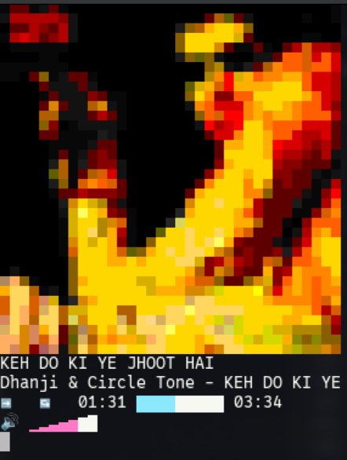

# Apple Music CLI Player

[](https://www.apple.com/macos/)
[](https://www.gnu.org/software/bash/)
[](LICENSE)
[](https://github.com/atanunq/viu)

*Originally tested on macOS 12 & 13, this version tested on 15 (likely to work on macOS 10.15, 11). **Can be called with the system default zsh.** The original author recommends aliasing am.sh to `alias am=zsh path/to/am.sh`, or moving its three individual functions into your .zshrc.*

**Original Goal:** As stated by the original creator: "Provide a simple command-line interface to listing out, playing songs from, and utilizing controls for Music.app" without building a full TUI application, preferring "quick commands and a light widget".

## ✨ Features

- 🎨 **Multiple album art sizes**: `small`, `large`, `xl`, and `square` modes
- 📐 **Square layout mode**: Perfect aspect ratio for terminal widgets (35x18)
- 🔄 **Smart text positioning**: Text automatically positioned below album art for larger sizes
- 📜 **Scrolling text**: Long track names, artists, and albums scroll smoothly when they exceed display width
- 🚀 **Setup script**: Automated installation with dependency management


---



## 🚀 Quick Start

### Automated Installation

```bash
# Install dependencies and set up the CLI
./setup.sh
```

The setup script will:
- ✅ Install dependencies (`viu`, `fzf`) via Homebrew
- ✅ Copy scripts to appropriate locations (`~/.local/bin`, `~/Library/Scripts`)
- ✅ Update your shell configuration (PATH and aliases)
- ✅ Verify Apple Music app availability

### Manual Installation

```bash
# Install dependencies
brew install viu fzf

# Copy files
mkdir -p ~/.local/bin ~/Library/Scripts
cp src/am.sh ~/.local/bin/am
cp src/album-art.applescript ~/Library/Scripts/album-art.applescript
chmod +x ~/.local/bin/am

# Add to PATH (in ~/.zshrc or ~/.bashrc)
export PATH="$HOME/.local/bin:$PATH"
```

## 🎨 Display Modes

### Album Art Sizes

```bash
am np                    # Default size (31x14) with text to the right
am np -s small          # Compact mode (25x12)
am np -s large          # Large album art (45x20) - text below
am np -s xl             # Extra large (60x28) - text below
am np -s square         # Perfect square ratio (35x18) - text below
am np -t                # Text mode only (no album art)
```

### Smart Layout Detection

- **Standard size**: Text positioned to the right (original behavior)
- **Custom larger sizes**: Text automatically positioned below album art
- **Square mode**: Optimized layout for terminal widgets and tiling window managers

### Scrolling Text Feature

When track names, artists, or album names exceed the available display width, they automatically scroll horizontally to show the full text:

- **Smooth animation**: Text scrolls character by character at a comfortable speed
- **Automatic cycling**: Text scrolls from start to end and repeats
- **All display modes**: Works in text mode, square mode, large/XL modes, and default layout
- **Smart width detection**: Automatically adjusts to the available space in each mode

## 📖 Usage

### Now Playing Widget

```bash
am np                    # Standard now playing widget
am np -s square         # Square layout (great for terminal corners)
am np -s large          # Large album art with text below
```

**Controls within np widget:**
- `p` - Play/Pause
- `f` - Forward one track
- `b` - Backward one track
- `>` / `<` - Fast forward/rewind
- `R` - Resume normal playback
- `+` / `-` - Volume up/down (Music.app specific)
- `s` - Toggle shuffle
- `r` - Toggle repeat (off → all → one → off)
- `q` - Quit widget
- `Q` - Quit widget and Music.app
- `?` - Show/hide keybindings

### Music Playback

```bash
# Interactive selection (uses fzf)
am play -a              # Browse artists
am play -r              # Browse albums
am play -s              # Browse songs
am play -p              # Browse playlists
am play -g              # Browse genres
am play -l              # Play entire library

# Direct playback by name
am play -a "Radiohead"       # Play artist
am play -r "OK Computer"     # Play album
am play -s "Paranoid Android" # Play song
```

### Browse Music Library

```bash
# List all items
am list -a              # List artists
am list -r              # List albums
am list -s              # List songs
am list -p              # List playlists
am list -g              # List genres

# List songs from specific items
am list -a "Radiohead"       # Songs by artist
am list -r "OK Computer"     # Songs in album
am list -p "My Playlist"     # Songs in playlist
```

### Convenient Aliases

After setup, use these shorter commands:

```bash
amn                     # am np (now playing)
amq                     # am np -s square (square mode)
amp -a                  # am play -a (browse artists)
aml -p                  # am list -p (list playlists)
```

## 🎯 Perfect for Terminal Setups

The **square mode** (`am np -s square`) is specifically designed for:

- **Tiling window managers** (i3, yabai, etc.)
- **Terminal multiplexers** (tmux, screen)
- **Corner terminal widgets**
- **Minimal desktop setups**

Features:
- ✅ Proper aspect ratio accounting for terminal character dimensions
- ✅ Clean layout with album art on top, info below
- ✅ Compact 35x18 size fits well in small terminal windows
- ✅ No text overflow or overlap issues

## 🔧 Requirements

- **macOS** 10.15+ (tested on 12. 13 & 15)
- **Apple Music app** installed and configured
- **Homebrew** (for automatic dependency installation)
- **Terminal** with 256-color support for best experience

### Dependencies

- [`viu`](https://github.com/atanunq/viu) - Terminal image viewer for album artwork
- [`fzf`](https://github.com/junegunn/fzf) - Fuzzy finder for interactive selection

Both are automatically installed by the setup script via Homebrew.

## 🐛 Troubleshooting

### Common Issues

**"Music got an error: Application isn't running. (-600)"**
- **Solution**: Restart your Mac. This occasionally happens after Music.app has been running for extended periods.

**Album art not displaying**
- Ensure `viu` is installed: `brew install viu`
- Verify album artwork exists for the current track
- Try text mode: `am np -t`

**Commands not found after installation**
- Verify `~/.local/bin` is in PATH: `echo $PATH | grep .local/bin`
- Restart terminal or source config: `source ~/.zshrc`
- Check permissions: `ls -la ~/.local/bin/am`

### Advanced Configuration

**Custom album art dimensions** (for advanced users):
Edit the size variables in the `np()` function to match your terminal's character aspect ratio.

**Terminal compatibility**:
Confirmed working terminals: Terminal.app, WezTerm. Some terminals (like iTerm2) may show refresh artifacts. Terminal.app typically works best for smooth updates.

## 🤝 Contributing

This is a fork focused on improved terminal integration and usability. Feel free to:

- 🐛 Report issues
- 💡 Suggest new features
- 🔧 Submit pull requests
- ⭐ Star the repo if you find it useful!

## 📝 Notes

- Interfaces with Apple Music via AppleScript (macOS only)
- Works with tracks in your library (downloads not required)
- Creates temporary playlist (`temp_playlist`) for album/artist playback
- Album artwork cached temporarily in `~/Library/Scripts/tmp*`

## 🙏 Attribution

This project is a fork of the original [Apple Music CLI Player](https://github.com/mcthomas/Apple-Music-CLI-Player) concept. Special thanks to the original creator [Matt Thomas](https://github.com/mcthomas) for the foundational AppleScript techniques and CLI design philosophy.

## 📄 License

[MIT License](LICENSE) - Feel free to use, modify, and distribute.

---

*Enjoy your command-line music experience! 🎵*
